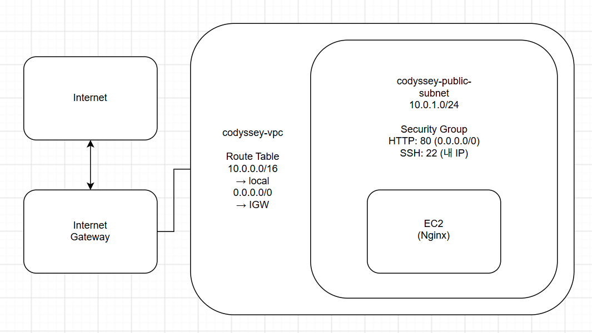

# AWS 클라우드 웹 서비스 구축

## 1. 프로젝트 소개

AWS 환경에서 VPC와 Public Subnet을 구성하고 EC2 인스턴스에 Nginx 웹 서버를 배포하여 외부에서 접속 가능한 웹 서비스를 구축하였다.
현재는 과금 방지를 위해 모든 리소스를 정리한 상태이며, 실습 기록을 스크린샷 등을 통해 남겨두었다.

## 2. 아키텍처



### 구성 요소

* VPC: `codyssey-vpc` (10.0.0.0/16`)
* Public Subnet: `codyssey-public-subnet` (10.0.1.0/24, ap-northeast-2a)
* Route Table: 0.0.0.0/0 → `codyssey-igw`
* Internet Gateway: `codyssey-igw`
* Security Group: `codyssey-sg`
    - HTTP 80: 0.0.0.0/0
    - SSH 22: 121.135.181.35/32
* EC2: `codyssey-ec2`, t2.micro, gp3 8 GiB
* IAM: `codyssey-user`, AdministratorAccess 미부여

### 네트워크 흐름

```text
Internet
   ↓
Internet Gateway
   ↓
VPC
   ↓
Public Subnet
   ↓
Security Group
   ↓
EC2
   ↓
Nginx
```

## 3. AWS 환경

* Region: `ap-northeast-2 (서울)`
* VPC: `vpc-0fc3f6cd3495bc113`
* Subnet: `subnet-0ec93b56368749a79`
* EC2: `codyssey-ec2`
* OS: Amazon Linux 2023
* Web Server: Nginx

## 4. 보안 그룹

필요한 포트만 인바운드로 허용하였다.

| Protocol | Port | Source      | 용도        |
| -------- | ---: | ----------- | --------- |
| TCP      |   80 | `0.0.0.0/0` | HTTP 웹 접속 |
| TCP      |   22 | 개인 IP       | SSH 접속    |

전체 포트(`0-65535`)를 외부에 개방하지 않고 SSH는 개인 IP로 제한하였다.

## 5. 웹 서버 배포

EC2에 Nginx를 설치하고 서비스를 실행하였다.

```bash
sudo dnf install nginx -y
sudo systemctl start nginx
sudo systemctl enable nginx
```

EC2 내부에서 다음 명령으로 정상 동작을 확인하였다.

```bash
curl -i http://localhost
```

`HTTP/1.1 200 OK` 응답을 확인하였다.

## 6. 외부 접속 검증

검증 방식: **A - 브라우저 접속**

URL: `http://43.203.210.58`

외부 브라우저에서 Nginx 기본 페이지가 정상적으로 출력되는 것을 확인하였다.

## 7. 트러블슈팅

SSH 접속 과정에서 다음 오류가 발생하였다.

```text
ssh: connect to host 43.203.210.58 port 22: Connection timed out
```

보안 그룹의 SSH(22) 인바운드 규칙과 네트워크 구성을 확인하고 필요한 설정을 수정하였다.

자세한 내용은 [트러블슈팅 보고서](docs/troubleshooting.md)를 참고한다.

## 8. 리소스 정리

실습 종료 후 생성한 AWS 리소스를 삭제하여 불필요한 과금이 발생하지 않도록 정리하였다.

정리 결과는 [Cleanup Checklist](docs/cleanup-checklist.md)에 기록하였다.

## 9. 재현 절차

1. AWS 서울 리전(`ap-northeast-2`)을 선택한다.
2. VPC와 Public Subnet을 생성한다.
4. Internet Gateway를 생성하고 VPC에 연결한다.
5. Route Table을 생성하고 Public Subnet에 연결한다.
6. Route Table에 `0.0.0.0/0 → Internet Gateway` 경로를 추가한다.
7. Security Group을 생성하고 HTTP(80) `0.0.0.0/0`, SSH(22) 개인 IP로 인바운드 규칙을 설정한다.
8. Amazon Linux 2023 기반 EC2 인스턴스를 Public Subnet에 생성한다.
9. EC2에 SSH로 접속한다.
10. Nginx를 설치하고 실행한다.
```bash
sudo dnf install nginx -y
sudo systemctl start nginx
sudo systemctl enable nginx
```
11. 서버 내부에서 정상 응답을 확인한다.
```bash
curl -i http://localhost
```
12. 브라우저에서 EC2의 Public IP로 접속하여 Nginx 페이지가 출력되는 것을 확인한다.
```text
http://<EC2 Public IP>
```

## 10. 증빙

[스크린샷 폴더](screenshots/)
